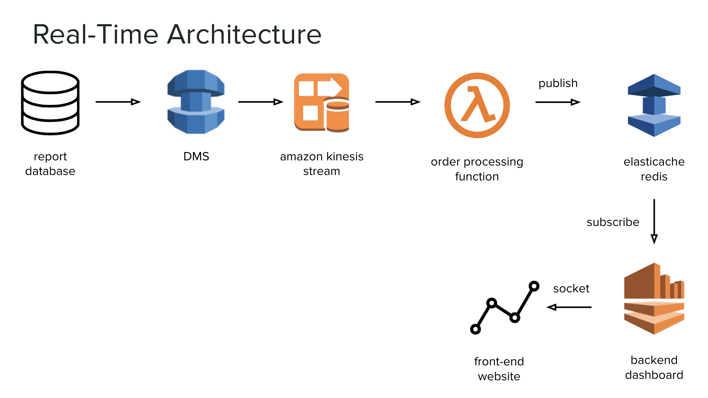

# POC on a realtime dashboard

This POC is for building a real time dashboard to displays always up-to-date metrics from an order processing system. 

Please find below the high level architecture.

The main components are:

* Report database: a mysql database that fed by an order processing system, that capture order transitions and status

* DMS: amazon database migration system, it mirrors the data as soon the comes in to feed to the kinesis stream

* Kinesis: aws real-time data streaming service

* checkout-report-consumer: lambda function that consumes the stream and calculates metrics

* Redis: key-value database system to store metrics

* checkout-dashboard: dashboard that query from Redis and shows metrics; it subscribes to Redis changes

## Related links

* https://aws.amazon.com/blogs/database/building-a-real-time-sales-analytics-dashboard-with-amazon-elasticache-for-redis/

* https://github.com/aws-samples/aws-elasticache-retail-dashboard